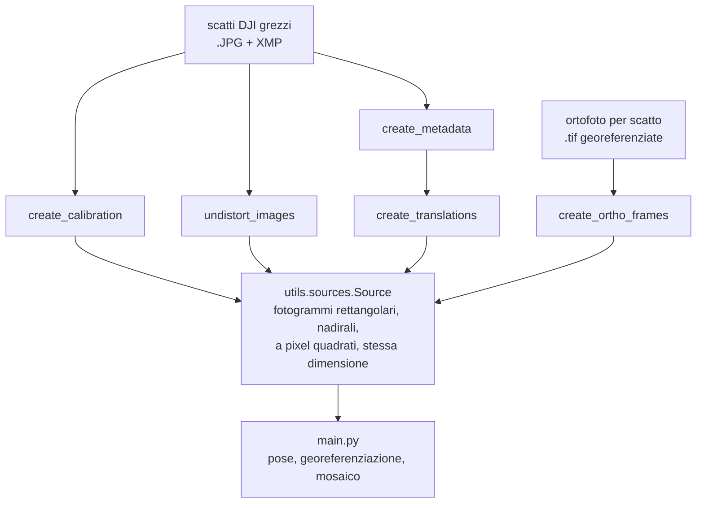

# stitching-rifatto

Compone un **mosaico georeferenziato** — un GeoTIFF in UTM, con alfa e piramidi interne —
dalle immagini di un volo drone a greca.

Tutto ciò che caratterizza il volo (range dei frame, direzione delle passate, scatti in
virata, overlap, risoluzione di lavoro) viene dedotto dai dati. Le opzioni servono solo a
scavalcare la deduzione quando serve.

```bash
python main.py immagini/georef
```

---

## Indice

- [L'idea](#lidea)
- [Requisiti](#requisiti)
- [I due formati di consegna](#i-due-formati-di-consegna)
- [Preprocessing](#preprocessing)
- [Comporre il mosaico](#comporre-il-mosaico)
- [Cosa produce](#cosa-produce)
- [Un esempio completo](#un-esempio-completo)
- [Come si legge l'output](#come-si-legge-loutput)
- [Architettura](#architettura)
- [Quando qualcosa non torna](#quando-qualcosa-non-torna)
- [Le costanti, e da dove vengono](#le-costanti-e-da-dove-vengono)

---

## L'idea

Due decisioni governano tutto il resto.

**1. Il GPS non partecipa allo stitching.** La ricostruzione nasce con scala propria,
orientamento proprio e forma propria:

| cosa | da dove |
|---|---|
| scala | quota barometrica ÷ focale rettificata |
| orientamento | bussola (nord **vero**, non nord griglia UTM) |
| forma | odometria come seed, immagini come misura |
| **posizione** | **GPS, e solo qui** |

Il GPS entra in un punto solo, l'ultimo, per collocare nel mondo una ricostruzione che ha
già scala e orientamento. Il vantaggio non è ideologico: non avendo contribuito, il GPS
resta un insieme di validazione **indipendente**, e il residuo del fit finale è una misura
onesta di quanto è buona la ricostruzione.

Quando la consegna non lo permette — le ortofoto per scatto non hanno velocità inerziali
registrate, quindi l'unica traslazione disponibile è il GNSS — il programma **lo dichiara**
invece di stampare la stessa frase.

**2. La pipeline ha una frattura netta a metà.** Da `utils.pairing` in poi nulla sa come
sono nate le pose: si vedono solo impronte, pixel e trasformazioni. Tutto ciò che sta prima
serve a capire il volo, e dipende dal formato in cui è arrivato. La frattura è un oggetto,
[`utils.sources.Source`](utils/sources.py), non una convenzione implicita.

> **Regola.** Nessun parametro della pipeline può dipendere dal formato di consegna. Se un
> valore differisce fra due sorgenti dev'essere *calcolato* da qualcosa di misurabile — la
> dimensione del fotogramma, l'impronta a terra, la distribuzione delle sovrapposizioni —
> mai deciso in base a chi ha prodotto i file.

**Due passate sul disco, a risoluzioni diverse.** La prima stima le pose su immagini
ridotte, perché la localizzazione delle feature non migliora abbastanza a piena risoluzione
da giustificarne il costo. La seconda compone il mosaico a piena risoluzione, a bande, e lo
scrive man mano nel GeoTIFF: il canvas di un volo grande è dell'ordine del gigapixel e non
esiste alcun momento in cui stia tutto in memoria.

---

## Requisiti

- **Python 3.14** (testato su 3.14.6)
- Le dipendenze di `requirements.txt`:

```bash
pip install -r requirements.txt
```

  `numpy`, `opencv-python`, `pyproj`, `rasterio`, `scipy`, `tqdm`.
  *(`plotly` è elencato ma non lo importa nessun modulo.)*

- **exiftool**, incluso nel repo in `exiftool-13.53_64/` (build Windows). Serve solo alla
  catena DJI, per estrarre la telemetria.

I comandi si lanciano **dalla radice del progetto**, con `python -m`: gli script di
preprocessing importano `preprocessing` e `utils` come package.

---

## I due formati di consegna



| | **A — DJI** | **B — ortofoto per scatto** |
|---|---|---|
| file | `.JPG` con blocco XMP DJI | `.tif` con tag GDAL `SHOT_*` |
| chi la produce | drone DJI | Pix4D, Agisoft, DJI Terra, alcune camere |
| scala da | quota barometrica ÷ focale | passo del geotransform |
| orientamento da | bussola (nord vero) | asse del rettangolo di ripresa, misurato |
| traslazione da | odometria XMP integrata | **GNSS** (non c'è altro) |
| il residuo finale è | validazione **indipendente** | **no**, e il programma lo dice |

Il riconoscimento è automatico dall'estensione dei file; `--sorgente exif|ortho` lo forza.

---

## Preprocessing

### A — Immagini DJI + telemetria EXIF/XMP

Quattro comandi, **in quest'ordine**, tutti sulla cartella degli scatti **originali**:

```bash
python -m preprocessing.create_calibration immagini/<volo>
```
```bash
python -m preprocessing.undistort_images immagini/<volo>
```
```bash
python -m preprocessing.create_metadata immagini/<volo>
```
```bash
python -m preprocessing.create_translations
```

Perché gli originali: **la rettifica non ricopia il blocco XMP**, quindi sulle immagini
prodotte da `undistort_images` l'assetto non è più leggibile. Puntare uno dei primi tre su
una cartella già rettificata fallisce subito, dicendo esattamente questo.

| comando | produce | a cosa serve |
|---|---|---|
| `create_calibration` | `data/calibration.json` | focale e dimensione delle immagini **rettificate**: l'unico numero da cui dipende tutta la scala metrica |
| `undistort_images` | `<volo>_rettificate/` | corregge la distorsione e ritaglia al rettangolo valido |
| `create_metadata` | `data/metadata.json` | GPS, quota, assetto, velocità, istante di scatto |
| `create_translations` | `data/translations.json` | delta `[est, nord]` fra scatti, cioè l'odometria |

`undistort_images` scrive di default in `<cartella>_rettificate`, accanto all'originale;
`--output DIR` lo cambia. Il nome dei file viene mantenuto: è l'unico legame fra
un'immagine rettificata e la sua telemetria, perché il numero di frame si ricava dal nome.

`create_calibration` e `undistort_images` deducono gli intrinseci dallo stesso primo scatto
e con la stessa funzione ([`_xmp.parametri_rettifica`](preprocessing/_xmp.py)), così
calibrazione e immagini non possono divergere. Se lo fanno comunque — cartelle diverse —
il controllo di `verify_image_size` in avvio se ne accorge.

### B — Ortofoto per scatto

Un comando solo:

```bash
python -m preprocessing.create_ortho_frames immagini/<volo>
```

Produce `<volo>_rettificate/` — accanto alla consegna, con la stessa convenzione che
`undistort_images` usa per il formato A — e `data/ortho_<volo>.json`.

Questo formato ha due proprietà che lo rendono inservibile così com'è, e il pre-pass
**disfa il confezionamento** invece di digerirlo a valle:

- **il pixel a terra non è quadrato.** Il fotogramma nativo viene riscritto nel proprio
  bounding box nord-up mantenendo la dimensione raster; l'anisotropia misurata sui voli di
  prova sta fra 1,264 e 1,338. Le pose sono similarità, che hanno una sola scala: quello
  stiramento non avrebbe dove finire e sparirebbe in silenzio, deformando il mosaico.
- **metà del riquadro è vuota.** Il fotogramma sta dentro il suo bounding box ruotato,
  quindi gli angoli sono nodata e i pixel utili sono il 51%. Impronte, cuciture e feature
  lavorerebbero tutte su un rettangolo che a terra non copre.

Il pre-pass ricampiona ogni ortofoto in un fotogramma rettangolare a pixel quadrati
allineato alla ripresa. Che l'impronta valida sia davvero un rettangolo non è un'ipotesi:
riproiettandola in UTM i suoi angoli interni stanno fra 88,0 e 91,6 gradi. Quale lato sia
along-track non si assume, **si vota** su tutti gli scatti del volo — nulla vieta a una
missione di volare con la camera girata di 90 gradi.

`--margine PX` (default 4) è di quanto si rientra dal bordo dell'impronta valida, per
lasciare fuori la frangia scura che il ricampionamento dello scrittore lascia contro il
nodata.

---

## Comporre il mosaico

```bash
python main.py <cartella_volo>
```

Per il formato A la cartella è quella delle **rettificate**; per il formato B è quella
delle ortofoto originali (i fotogrammi prodotti dal pre-pass li ritrova da solo).

| opzione | default | cosa fa |
|---|---|---|
| `--da N` | primo presente | primo frame dell'intervallo |
| `--a M` | ultimo presente | ultimo frame, incluso |
| `--overlap-frontale F` | `0.5·(1+laterale)` | overlap a cui diradare lungo la passata |
| `--overlap-laterale L` | `0.25`, e scende se serve | sovrapposizione minima per accoppiare due scatti |
| `--sorgente auto\|exif\|ortho` | `auto` | formato di consegna |

Entrambi gli overlap accettano `none` per disattivarli.

**Sul default di `--overlap-frontale`.** `0.5·(1+laterale)` è il diradamento più spinto che
lascia comunque legato ogni scatto sia al vicino sia a quello dopo: con bersaglio *T* i
consecutivi si sovrappongono di *T* e quelli a salto uno di *2T−1*, che deve restare sopra
la soglia laterale. Così la catena lungo la passata sopravvive a un aggancio fallito.

**Sul default di `--overlap-laterale`.** Si parte da 0.25 e si **scende solo se il grafo
esce spezzato**, perché senza legami fra le passate le loro posizioni reciproche restano
indeterminate e nessun peso lo compensa. Un volo che tiene alla soglia di partenza non si
muove di un millimetro. Se invece scrivi tu una soglia sulla riga di comando, quella viene
usata e basta: chi la impone vuole quella, non una dedotta.

---

## Cosa produce

Tutto in `output/`:

| file | cos'è |
|---|---|
| `mosaic.tif` | il mosaico. GeoTIFF in UTM, 4 bande uint8 (RGB + alfa), LZW, tiled 256×256, `BIGTIFF=IF_SAFER`, piramidi interne 2/4/8/16/32 |
| `mosaic_preview.jpg` | anteprima, lato lungo max 2000 px. Il GeoTIFF è troppo grande da guardare |
| `mosaic_layout.jpg` | **diagnostico**: le impronte come rettangoli colorati in ordine temporale (rosso → magenta), col numero di frame e la freccia di rotta |
| `<nome>_mosaic.csv` | un CSV di punti della cartella del volo, riscritto con i valori tarati sul mosaico. Gli originali non vengono toccati |

Il **layout** va guardato prima del mosaico: costa un istante e mostra subito una passata
fuori posto, mentre accorgersene dal mosaico costa l'intera composizione.

Sui **CSV**: accanto alle immagini possono arrivare dei rilievi con le coordinate tarate su
*uno* scatto. Composto il mosaico quel pixel non esiste più. La rimappatura passa per la
**posa raffinata**, non per la latitudine dichiarata: la seconda darebbe una coordinata
geograficamente corretta ma sul mosaico cadrebbe *accanto* alla feature, sfalsata di quanto
il raffinamento ha spostato quell'immagine — che è esattamente ciò che tutta la pipeline
serve a stimare. Lo scarto fra le due strade finisce nel riepilogo.

---

## Un esempio completo

Volo `immagini/georef`, 23 ortofoto per scatto. Output **reale** di una corsa completa —
solo i percorsi assoluti sono stati accorciati.

```console
$ python -m preprocessing.create_ortho_frames immagini/georef
23 ortofoto in immagini\georef | EPSG:32632
  asse along-track: il lato CORTO del rettangolo di ripresa
  anisotropia del pixel consegnato: da 1.2640 a 1.2677
  GSD comune 4.305 mm/px (quadrato) | fotogramma 1591x1171 = 6.85 x 5.04 m
  residuo delle linearizzazioni UTM/lon-lat: 1.85e-04 px sul warp, 3.11e-03 mm sul geotransform sorgente
  copertura dell'impronta erosa: da 99.9941% a 100.0000% (il riquadro consegnato ne copriva il 51%)
  23 fotogrammi in immagini\georef_rettificate
```

```console
$ python main.py immagini/georef

== Caricamento
  23 scatti (frame 8..30), fotogrammi 1591x1171, GSD 4.305 mm/px
  ortofoto per scatto: le posizioni vengono dai tag SHOT_LAT/LON, quindi il GPS semina la ricostruzione
  tag e geotransform discordano di 0.402 m di mediana, 1.091 m di massimo

== Frame locale (seminato dal GPS)
  estensione 18 x 26 m | GSD 0.00431 m/px | impronta 6.8 x 5.0 m

== Passate
  rotta dominante -35.04 gradi | 0 scatti in virata | 3 passate da 4 a 10 scatti
  diradamento a overlap 62%: 23 scatti su 23 non in virata

== Pose iniziali
  lavoro a 795x585 (fattore 2.00148), GSD canvas 0.00862 m/px

== Grafo delle coppie
  soglia abbassata da 25% a 15%: sopra, il grafo restava spezzato e le passate non avrebbero avuto legami reciproci
  33 coppie sopra il 15%

== Feature ORB (tetto 3000 per scatto)
  68949 feature in 3 MB (restano in memoria per tutto il volo)

== Matching
  21/33 vincoli validi (scartati: 12 con pochi inlier, 0 in disaccordo col seed)
  il grafo non regge: rialzo il tetto delle feature da 3000 a 12000 e riprovo (circa 93 s)

== Feature ORB (tetto 12000 per scatto)
  269831 feature in 11 MB (restano in memoria per tutto il volo)

== Matching
  27/33 vincoli validi (scartati: 6 con pochi inlier, 0 in disaccordo col seed)
  1 componenti (la maggiore 23) | grado 1/2/3 | 5 cicli indipendenti

== Raffinamento globale
  residuo fotografico mediano 44.84 px -> 1.30 px
  scala dei fotogrammi: da 0.916 a 1.072 volte il seed

== Georeferenziazione (chiusura sul GPS)
  EPSG:32632
  rotazione assorbita +0.207 gradi, attesa nulla perche' il frame locale e' gia' in nord griglia
  scala +2.56%
  scarto dal GPS: mediana 0.42 m, RMS 0.56 m, massimo 1.14 m (0 outlier su 23)
  NB: il GPS ha seminato anche le posizioni, quindi questo scarto NON e' una validazione indipendente della ricostruzione.

== Mosaico
  scatti a 1591x1171 | canvas 5926x8003 = 47 Mpx | GSD 0.00431 m/px
  layout diagnostico: output\mosaic_layout.jpg

== Piano di fusione
  guadagni da 0.766 a 1.286 (deviazione standard 0.109) | 5 s

== Composizione
  output\mosaic.tif (109 MB) | 53 letture per 23 scatti (2.30 per scatto)
  anteprima: output\mosaic_preview.jpg

== Punti sul mosaico
  mine_mosaic.csv: 5/5 punti | il raffinamento li ha spostati di 0.420 m di mediana, 0.540 m di massimo
  subsoil_data_mosaic.csv: 54/54 punti | il raffinamento li ha spostati di 0.436 m di mediana, 1.828 m di massimo | 2 letti sullo scatto accanto, fuori dal proprio

== Fine, in 38 s
```

Questa corsa mostra due rimedi automatici che scattano: la soglia laterale **scesa da 25% a
15%** perché a 25% il grafo restava spezzato, e il tetto delle feature **rialzato da 3.000 a
12.000** perché con 21 vincoli il grafo non aveva abbastanza anelli. Su un volo che regge al
primo tentativo nessuno dei due si muove.

---

## Come si legge l'output

### Caricamento e passate

`rotta dominante` è l'asse del volo, stimato raddoppiando gli angoli così che due rotte
opposte diventino lo stesso angolo. Se il volo non ha un asse dominante — una spirale — la
segmentazione in passate non ha senso e il programma si ferma.

`scatti in virata` non entrano nel mosaico: la camera si muove in fretta e la copertura è
fuori dall'area da rilevare. **Non spariscono però dal problema**: la loro odometria resta,
ed è quella che trasporta la posizione da una passata alla successiva quando il matching
fra passate adiacenti non regge.

### Grafo delle coppie e matching

Le tre cifre da guardare sono nella riga dopo il secondo matching:

```
1 componenti (la maggiore 23) | grado 1/2/3 | 5 cicli indipendenti
```

| | significato |
|---|---|
| **componenti** | quanti pezzi scollegati. **Più di 1 è grave**: senza GPS nell'ottimizzazione, le posizioni reciproche fra componenti sono indeterminate |
| **grado** min/mediano/max | quanti partner ha ogni scatto. Un grado minimo 0 significa scatti isolati |
| **cicli indipendenti** | quanti anelli chiude il grafo: `vincoli − nodi + componenti` |

I **cicli indipendenti** sono l'unico modo di leggere onestamente il residuo del
raffinamento. Un grafo ad albero ne ha zero: ogni vincolo si può soddisfare esattamente, il
residuo crolla vicino a zero, e quel numero **non dice nulla** sulla qualità della
ricostruzione — dice solo che non c'era ridondanza a contraddirla. Sotto un quarto dei nodi
il programma avverte.

Va guardato **dopo** il matching e non prima: quello che regge il mosaico non sono le coppie
tentate ma i vincoli che ne sono usciti, e fra le due cose ci può essere un terzo di
differenza.

### Raffinamento globale

```
residuo fotografico mediano 44.84 px -> 1.30 px
scala dei fotogrammi: da 0.916 a 1.072 volte il seed
```

La prima riga è quanto le coppie si contraddicono, prima e dopo. La seconda è il suo
**rovescio**, e va letta insieme: il residuo può crollare proprio *perché* le pose si sono
deformate fino a soddisfare vincoli sbagliati.

La scala del seed non è un'ipotesi, viene da una misura — quota barometrica e focale, o
passo del geotransform — ed è buona al percento. Un raffinamento che la sposta del trenta
per cento su un fotogramma non sta correggendo quella misura: sta sfuggendo attraverso un
nodo che non ha abbastanza vincoli per trattenerlo. Oltre il 10% il programma avverte, e in
quel caso **le pose seed potrebbero essere migliori di quelle raffinate**.

### Georeferenziazione

```
rotazione assorbita +0.207 gradi, attesa nulla perche' il frame locale e' gia' in nord griglia
scala +2.56%
scarto dal GPS: mediana 0.42 m, RMS 0.56 m, massimo 1.14 m (0 outlier su 23)
```

Il fit è una **similarità completa**, non una traslazione, per due ragioni: deve assorbire
la convergenza del meridiano (la bussola misura il nord vero, UTM usa il nord griglia — al
sito di prova differiscono di 1,073°, cioè 5,7 m sui 297 m del volo) e l'errore di scala
residuo. Su una consegna DJI la riga stampa quanta rotazione era **attesa** e quanta ne
resta: il residuo dice se il frame locale era orientato come si credeva.

Sul formato B la rotazione attesa è zero, perché il frame locale nasce già in UTM.

Applicare una similarità globale a tutte le pose **non reintroduce il GPS nello stitching**:
sposta, ruota e scala il risultato in blocco, e non può cambiarne la forma.

Lo `scarto dal GPS` è la misura di qualità — ma solo se il GPS non ha seminato le posizioni.
Quando le ha seminate compare l'`NB:` che lo dice.

### Composizione

```
53 letture per 23 scatti (2.30 per scatto)
```

Il conteggio delle riletture. La composizione è guidata dall'**uscita**: si scorre il canvas
per bande orizzontali e per ciascuna si caricano solo gli scatti che la intersecano. Il
costo è qualche rilettura, in cambio il picco di memoria è quello di una banda sola.

I `guadagni` sono il fattore moltiplicativo per scatto scelto perché nelle zone in comune
due scatti concordino. Una deviazione standard alta segnala esposizioni molto diverse.

---

## Architettura

```
main.py                 le quattro fasi, e nient'altro

utils/
  sources               IL CONTRATTO: due formati di consegna, una pipeline sola
    source_exif           immagini rettificate + telemetria EXIF/XMP
    source_ortho          una ortofoto per scatto, già georeferenziata
  dataset               calibrazione, metadati, percorsi. Verifica che le immagini su
                        disco corrispondano alla calibrazione, prima di ogni altra cosa
  localframe            odometria integrata -> posizioni locali metriche
  flight                scatti in virata e segmentazione in passate, dal solo assetto
  poses                 posa iniziale di ogni scatto, e raffinamento globale
  footprint             impronta a terra, derivata dalla posa
─────────────────────── ⟨ la frattura: da qui in giù nulla sa da dove vengono le pose ⟩
  pairing               quali coppie vale la pena matchare, e il grafo è connesso?
  frames                lettura pigra a finestra scorrevole
  features              ORB, con i descrittori che restano per tutto il volo
  matching              corrispondenze e similarità fra due scatti
  georeference          fit di similarità sul GPS: l'unico punto in cui entra
  mosaic                geometria del canvas: dove va a finire ogni scatto
  compositing           guadagni, cuciture, fusione multibanda
  georef                scrittura del GeoTIFF in UTM
  points                CSV di punti rimappati sul mosaico
  geodesy               zona UTM, transformer, GSD, convergenza del meridiano

preprocessing/
  __init__              percorsi dei file di scambio, dichiarati una volta sola
  _xmp                  intrinseci e parametri di rettifica dal blocco XMP DJI
  _ortho                rettangolo di ripresa, assi, affini e warp di una ortofoto
  create_calibration    ⎫
  undistort_images      ⎬ catena A, nell'ordine
  create_metadata       ⎪
  create_translations   ⎭
  create_ortho_frames   catena B, in un passo solo
```

### Il vincolo di memoria come principio di progetto

Non è un dettaglio implementativo, è ciò che dà forma a metà del codice.

- `FrameReader` tiene una **finestra di 2 fotogrammi**, e usa i flag `IMREAD_REDUCED` che
  decodificano alla risoluzione ridotta *dentro* il decoder JPEG — a un quarto è circa otto
  volte più veloce, ed è gratis.
- **I pixel muoiono, i descrittori sopravvivono.** Un fotogramma a piena risoluzione occupa
  52 MB; i suoi 3.000 descrittori ORB, con le coordinate, ne occupano 0,18. È per questo che
  si possono agganciare passate lontane nel tempo senza tenere niente in RAM.
- La composizione procede a **bande di 2048 righe con un margine di 512**, scritte man mano
  nel GeoTIFF; l'anteprima si costruisce mentre le bande passano.

Ne risultano **tre scale**, non due: risoluzione ridotta per pose e piano di fusione,
`seam_megapix=0.1` per guadagni e cuciture, piena risoluzione per la sola fusione.

### Due scelte non ovvie

**Le maschere nadirali.** La successione classica dello stitching (Brown & Lowe 2007:
guadagni → cuciture → fusione multibanda di Burt & Adelson) nasce per le panoramiche, dove
tutte le immagini condividono il centro di presa e da quale arrivi un pixel è quasi
indifferente. In un volo a greca ogni punto è coperto da una dozzina di scatti che lo
guardano da angoli diversi, e il seam finder lasciato libero prende il 95% dei pixel oltre
metà raggio del fotogramma — cioè dalla vista più obliqua, dove il rilievo sposta di più.
Fondere due scatti che vedono lo stesso edificio inclinato da parti opposte produce un
fantasma traslucido, e nessuna regolazione della spline lo toglie. Il taglio parte quindi
dal territorio in cui ogni scatto è il **più nadirale**, con un margine di libertà per
aggirare un edificio o una siepe.

**La fusione multibanda, non la media.** Le pose hanno un residuo di qualche pixel a piena
risoluzione: mediare due scatti sdoppierebbe ogni tetto e ogni albero. La spline multibanda
prende le alte frequenze — dove sta il dettaglio — da un solo scatto per volta e le fa
cambiare bruscamente lungo la cucitura, mentre fa transitare dolcemente solo le basse
frequenze, dove il disallineamento non si vede.

---

## Quando qualcosa non torna

### Errori che fermano il programma

| messaggio | cosa significa |
|---|---|
| `file mancante: data/....json (generalo con preprocessing/)` | manca un passo di preprocessing |
| `Dati XMP non trovati ... questo passo vuole gli scatti ORIGINALI` | hai puntato `create_calibration`, `undistort_images` o `create_metadata` su una cartella già rettificata |
| `La calibrazione dichiara immagini WxH, ma ... è W'xH'` | calibrazione e immagini rettificate non vengono dalla stessa esecuzione. Rigenera la calibrazione |
| `metadata.json e translations.json non descrivono lo stesso volo` | i due file sono disallineati: rigenera `create_translations` |
| `Nessuna passata riconosciuta` | il volo non ha una direzione dominante, oppure il range `--da/--a` cade tutto dentro una virata |
| `Nessuna coppia di scatti si sovrappone abbastanza` | le impronte non si toccano. Controlla il range di frame e la quota |
| `Nessun vincolo fotografico valido` | le immagini non si agganciano fra loro. Controlla che siano quelle giuste e a fuoco |
| `riduzione anisotropa` | i fotogrammi non hanno pixel quadrati: le pose sono similarità e non possono assorbire una scala diversa per asse |
| `impossibile trovare una dimensione comune priva di nodata` | (formato B) le impronte dei singoli scatti sono troppo diverse perché un solo fotogramma le contenga tutte |
| `geotransform con rotazione, non gestito` | (formato B) l'ortofoto non è nord-up |

### Avvertimenti che non fermano nulla, ma vanno letti

| avvertimento | cosa fare |
|---|---|
| `pochi cicli, il grafo è quasi un albero` | il residuo del raffinamento sarà basso **perché non c'è ridondanza che lo contraddica**, non perché la ricostruzione sia buona. Non fidarti di quel numero |
| `i vincoli superstiti spezzano il volo in N componenti` | le posizioni reciproche fra i pezzi sono indeterminate. Prova ad abbassare `--overlap-laterale`, o guarda se la risoluzione di lavoro è sbagliata per questo terreno (sotto) |
| `N fotogrammi hanno cambiato scala di oltre il 10%` | quasi sempre un nodo con troppo pochi vincoli che scappa, non una correzione. **Le pose seed potrebbero essere migliori di queste** |

### Il sintomo più insidioso

Un grafo che si spezza *mentre le impronte si sovrappongono* è quasi sempre la **risoluzione
di lavoro** sbagliata per quel terreno. La scala a cui un terreno ha struttura dipende dal
terreno: a 4,3 mm/px l'erba è rumore, i descrittori si agganciano a niente, e fra le passate
non passa un solo vincolo. Ridurre la media via e lascia le strutture grandi.

Misurato su due voli, contando i vincoli superstiti:

| volo | riduzione | lato lungo | mm/px | vincoli |
|---|---|---|---|---|
| DJI (4909 px) | 4 | 1228 | 37,0 | 96 su 123 coppie |
| Altum (1591 px) | 1 | 1591 | 4,3 | 19, **0 fra passate** |
| Altum | 2 | 795 | 8,6 | 23, 3 fra passate |
| Altum | 4 | 397 | 17,3 | 23, 3 fra passate |

La costante `LATO_LUNGO_MINIMO` in [utils/frames.py](utils/frames.py) governa la scelta.

---

## Le costanti, e da dove vengono

Quasi tutto è dedotto dai dati. Quel poco che è tarato è tarato **su misure**, non su
intuizioni, ed è raccolto qui.

| costante | valore | dove | perché quel valore |
|---|---|---|---|
| `LATO_LUNGO_MINIMO` | 700 px | `utils/frames.py` | perché entrambi i voli di prova scelgano la riduzione giusta deve stare fra 614 e 795; 700 sta in mezzo |
| `feature_ladder` | 3k → 12k → 48k | `utils/features.py` | su terreno con struttura 3.000 bastano; su prato raso servono 30.000 per chiudere il grafo. Si sale solo se il grafo esce malato |
| budget descrittori | 600 MB | `utils/features.py` | accorcia la scaletta da sé sui voli lunghi: ciò che su venti scatti è gratis, su ottocento non lo è |
| `TEMPO_MASSIMO_RITENTATIVO_S` | 180 s | `main.py` | il matching è quadratico nel tetto: il terzo gradino può valere un'ora, e va saputo **prima** di pagarlo |
| `MARGINE_PX` | 4 px | `preprocessing/create_ortho_frames.py` | profilo di luminanza dal bordo: mediana 2 a un pixel, 24 a due, 45 a quattro, contro 88 all'interno |
| `halo` | 512 px | `utils/compositing.py` | contro il riferimento a banda unica: 597 pixel diversi su 19 Mpx per al più 3 livelli su 255, sotto il rumore del JPEG |
| `seam_megapix` | 0,1 Mpx | `utils/compositing.py` | i seam finder confrontano tutte le coppie e non scalano col volo: graphcut passa da 29 s a 244 s fra 40 e 80 scatti |
| `seam_finder` | `dp` | `utils/compositing.py` | nitidezza (varianza del laplaciano): nessun taglio 930,6 · dp 1.383,9 · graphcut 1.393,4. Lo 0,7% in più non vale il costo |
| `nadir_margin` | 16 px | `utils/compositing.py` | libertà del taglio rispetto al territorio nadirale |
| `vo_weight` | 0,5 | `utils/poses.py` | l'odometria disponibile sbaglia 0,46 m per passo, una dozzina di pixel, contro l'uno o due di un vincolo fotografico. Serve dove le immagini tacciono, non a correggerle |
| tolleranza `agrees_with_seed` | 0,25 diagonali | `utils/matching.py` | larga di proposito: scarta gli agganci assurdi su tessitura ripetitiva, non impone il seed alle immagini |

### Note misurate sui dati di prova

- L'**odometria** è un seed, non una verità: tolti rototraslazione e scala, il suo errore di
  forma contro il GPS è 4,2 m RMS con punte di 11,7 m. Localmente però è ottima (0,46 m per
  passo), ed è la scala locale quella che conta per decidere quali immagini si sovrappongono.
- La **quota barometrica** è più stabile di quella GPS: deviazione standard 0,05 m contro
  0,26 m su 835 scatti. Il GSD usa la prima.
- La **focale rettificata** differisce da quella XMP del 15%. È l'unico numero da cui dipende
  tutta la scala metrica.
- Il **gimbal** è stabilizzato: `gimbal_pitch_deg` ha mediana −90,00 e solo 28 scatti su 835
  se ne discostano oltre 2 gradi, mentre il drone vola con un roll di crociera di 5,2 gradi.
  Per questo il criterio del nadir guarda il gimbal e non il velivolo.
- Sul formato B, tag `SHOT_LAT/LON` e centro secondo il geotransform sono scostati di mezzo
  metro sistematico, quasi certamente il braccio di leva applicato da chi ha scritto
  l'ortofoto. Il tag semina il frame locale, il geotransform fa da bersaglio al fit: non è
  indipendenza, ma fa uscire allo scoperto quello scarto invece di sommarlo in silenzio.

---

## Struttura del repo

```
main.py                    punto di ingresso
requirements.txt
preprocessing/             dai file consegnati agli input della pipeline
utils/                     la pipeline
exiftool-13.53_64/         exiftool per Windows, incluso
immagini/                  i voli          (gitignored)
data/                      file di scambio (gitignored)
output/                    i risultati     (gitignored)
```
